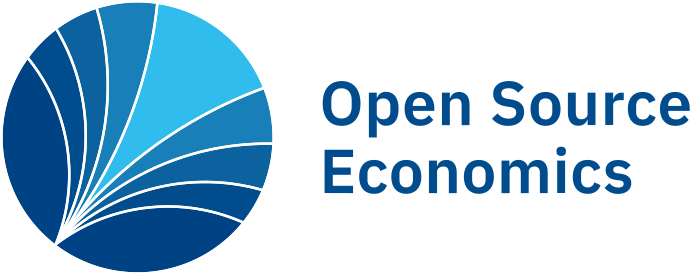
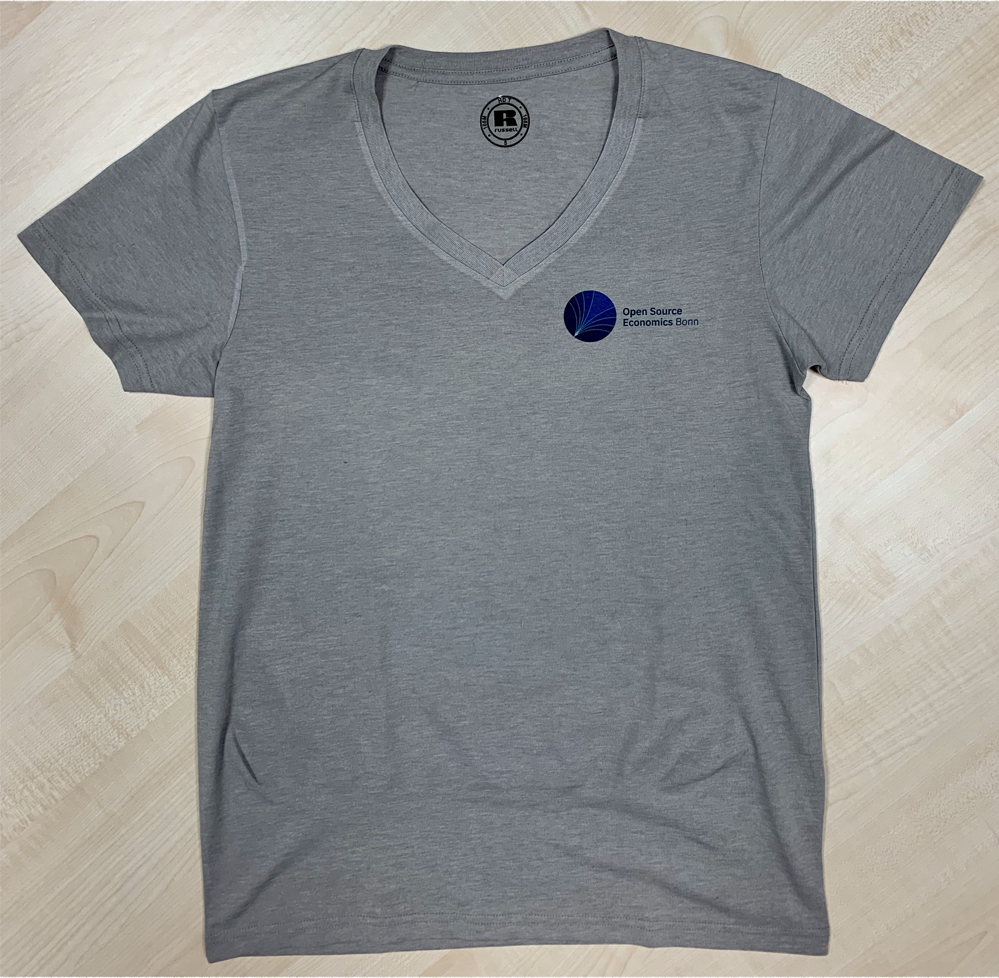
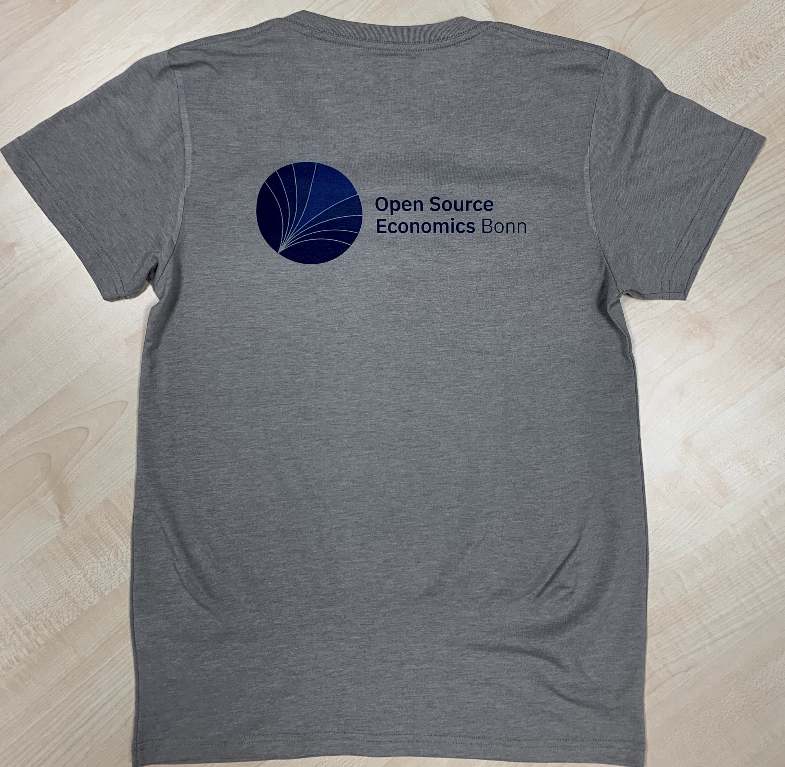
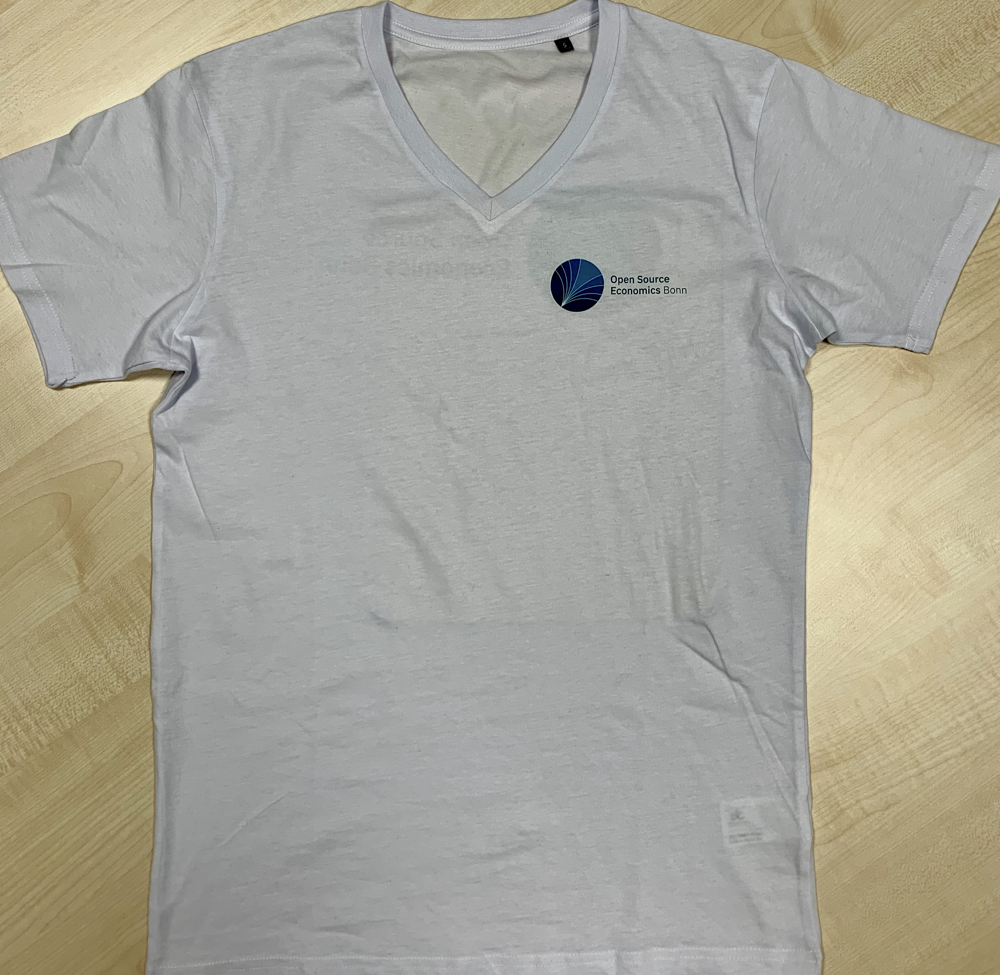

# OSE Corporate Design

  

## Table of Contents
[Templates](#templates)  
- [Presentations](#presentations)
- [CV](#cv)
<!-- - [Papers](#papers) -->

[Logo](#logo)
- [Font](#font)
- [Color Codes](#color-codes)  

[Merchandise](#merchandise)  

## [Templates](#table-of-contents)

In the following we will describe the usage of our templates for presentations, papers, conference posters, and CV's. The templates were designed by [Holger Gerhardt](https://github.com/HolgerGerhardt) and adjusted for the Open Source Economics initiative. We are very thankful for his support. 

### [Presentations](#templates)

In general, our presentations are assembled in the format 16:9. 
However, a priori it is often the case that we do not know which native aspect ratio is used by the projector at the host institution (either 4:3, 16:9, or 16:10). 

In that case, it may be appropriate to use an intermediate aspect ratio (see this [issue](https://github.com/josephwright/beamer/issues/497)). It minimizes the loss of available space while on average it looks good on nearly each projector. 

**How to use the template**

First, copy the complete [templates](https://github.com/OpenSourceEconomics/ose-corporate-design/tree/master/templates) folder into a new direction. In this folder, you will create your presentation. In case you need only a presentation, you might delete all other templates. Do not delete the [Images](https://github.com/OpenSourceEconomics/ose-corporate-design/tree/master/templates/Images) folder as it includes the logo for the presentation title slide.

Second, you should decide for your preferred aspect ratio (although you can adjust later). Take either [`Template_Presentation_4-3.tex`](https://github.com/OpenSourceEconomics/ose-corporate-design/blob/master/templates/Template_Presentation_4-3.tex), [`Template_Presentation_14-9.tex`](https://github.com/OpenSourceEconomics/ose-corporate-design/blob/master/templates/Template_Presentation_14-9.tex), [`Template_Presentation_16-9.tex`](https://github.com/OpenSourceEconomics/ose-corporate-design/blob/master/templates/Template_Presentation_16-9.tex), or [`Template_Presentation_16-10.tex`](https://github.com/OpenSourceEconomics/ose-corporate-design/blob/master/templates/Template_Presentation_16-10.tex). Rename your file in a way that reflects the purpose of your presentation.

Third, the file [`PresentationContent.tex`](https://github.com/OpenSourceEconomics/ose-corporate-design/blob/master/templates/PresentationContent.tex) provides you with all necessary commands to manufacture a modern and clean presentation. It is very convenient to use this file as a reference for commands. Hence, you could copy it and assemble your presentation within this file. Alternatively (and for a more structure approach), you can create new .tex-files and `\input{name_of_your_new_texfile}` them into your re-named "master-template". In any case, [`PresentationContent.tex`](https://github.com/OpenSourceEconomics/ose-corporate-design/blob/master/templates/PresentationContent.tex) serves as an incredible useful reference. 

Fourth, compile and spread the word of Open Source Economics. A complied version is accesible [here](https://github.com/OpenSourceEconomics/ose-corporate-design/blob/master/templates/Template_Presentation_16-9.pdf).

<!--
### [Papers](#templates)

to be defined
-->

### [CV](#templates)

A very neat and concise format for an academic CV is available under the templates folder. A compiled version can be accessed [here](https://github.com/OpenSourceEconomics/ose-corporate-design/blob/master/templates/Template_CV.pdf).

## [Logo](#table-of-contents) 

The available logos are, among others:
- [OSE logo](https://github.com/OpenSourceEconomics/ose-corporate-design/blob/master/logos/OSE_logo_RGB.pdf)
- [OSE Bonn logo](https://github.com/OpenSourceEconomics/ose-corporate-design/blob/master/logos/OSE_Bonn_logo_RGB.pdf)
- [OSE Bonn without any type](https://github.com/OpenSourceEconomics/ose-corporate-design/blob/master/logos/OSE_logo_no_type_RGB.pdf)

Grayscale and SVG versions are also available. For web pages, please use the [SVG version](https://github.com/OpenSourceEconomics/ose-corporate-design/blob/master/logos/OSE_Bonn_logo_RGB.svg).

<!--
**Measurements of the logo**

The [OSE logo chapter Bonn (medium and light font)](https://github.com/OpenSourceEconomics/ose-corporate-design/blob/master/logos/OSE_bonn_mdli.pdf) has following measurements:
- width: 242.6907 mm
- height: 95.2261 mm
- typo: 52pt ([IBM Plex Sans](https://fonts.google.com/specimen/IBM+Plex+Sans))

[OSE logo chapter Bonn (semi-bold and regular font)](https://github.com/OpenSourceEconomics/ose-corporate-design/blob/master/logos/OSE_bonn_sbre.pdf)
- width: 244.2131 mm
- height: 95.2261 mm
- typo: 52pt ([IBM Plex Sans](https://fonts.google.com/specimen/IBM+Plex+Sans))
-->

### [Font](#table-of-contents)

The logo uses the font [IBM Plex Sans](https://fonts.google.com/specimen/IBM+Plex+Sans), which can be implemented into LaTex via an `.sty` file. 
For automatic generation of LaTeX slides it is currently a recommended option to use the default LaTeX font, since sometimes bugs may occur. However, for the best visual presentation [IBM Plex Sans](https://fonts.google.com/specimen/IBM+Plex+Sans) is the preferred choice.

### [Color Codes](#table-of-contents)

**Font color** [OSEBlue (semi-dark blue)](https://www.color-hex.com/color/004c8d)
- Hex: #004C8D
- RGB: 0/76/141

**Logo colors** are presented from brightest to darkest

[OSEBlueLight (light blue)](https://www.color-hex.com/color/30bced)
- Hex: #30BCED
- RGB: 48/188/237

[Semi-light blue](https://www.color-hex.com/color/187fb9)
- Hex: #187FB9
- RGB: 24/127/185

[Medium blue](https://www.color-hex.com/color/0c619f)
- Hex: #0C619F
- RGB: 12/97/159

[OSEBlue (semi-dark blue)](https://www.color-hex.com/color/004c8d)
- Hex: #004C8D 
- RGB: 0/76/141

[Dark blue](https://www.color-hex.com/color/004385)
- Hex: #004385
- RGB: 0/67/133

## [Merchandise](#table-of-contents)

As a professional organization we will build up our personal merchandise line. Below you will find the first two sample shirts. At the next ose-meetup those will be presented along with an order catalogue. There will be high-quality hoodies, half-zipper, and shirts available. Stay tuned. 

  
   
  
  

